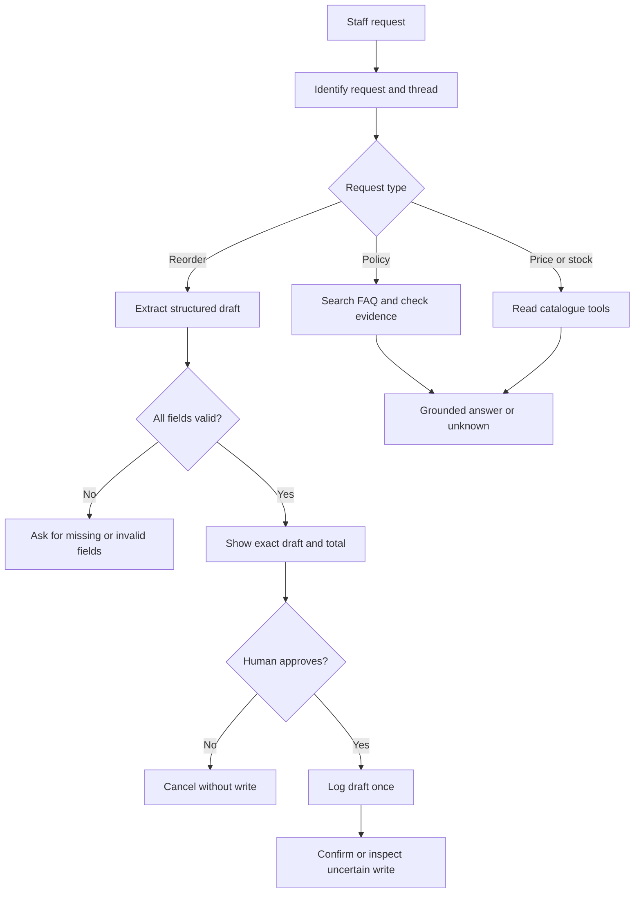

# Day 06 preparation — reorder request

```mermaid
flowchart TD
 A[Staff request] --> B[Identify request and thread]
 B --> C{Request type}
 C -->|Policy| D[Search FAQ and check evidence]
 C -->|Price or stock| E[Read catalogue tools]
 C -->|Reorder| F[Extract structured draft]
 F --> G{All fields valid?}
 G -->|No| H[Ask for missing or invalid fields]
 G -->|Yes| I[Show exact draft and total]
 I --> J{Human approves?}
 J -->|No| K[Cancel without write]
 J -->|Yes| L[Log draft once]
 L --> M[Confirm or inspect uncertain write]
 D --> N[Grounded answer or unknown]
 E --> N
```

Synthetic data only. This is a proposed workflow, not a Day 06 LangGraph implementation.
